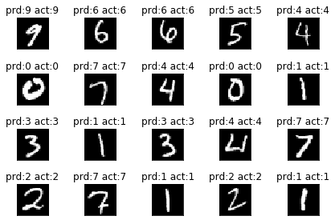
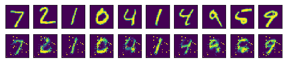

# TF的处理结构


## Tensor 张量意义
**张量（Tensor):**

* 张量有多种. 零阶张量为 纯量或标量 (scalar) 也就是一个数值. 比如 [1]
* 一阶张量为 向量 (vector), 比如 一维的 [1, 2, 3]
* 二阶张量为 矩阵 (matrix), 比如 二维的 [[1, 2, 3],[4, 5, 6],[7, 8, 9]]
* 以此类推, 还有 三阶 三维的 …
[see more](http://blog.csdn.net/u013378306/article/details/56281549)


```python
#Shape in TF
# -*- coding: utf-8 -*-
import tensorflow as tf
import numpy as np
```


```python
sess = tf.Session()
a = tf.constant(np.arange(24),shape=[2,3,4],dtype=tf.float32)
print(sess.run(a))
print(sess.run(tf.reshape(a,shape=[1,4,6])))
```

    [[[  0.   1.   2.   3.]
      [  4.   5.   6.   7.]
      [  8.   9.  10.  11.]]
    
     [[ 12.  13.  14.  15.]
      [ 16.  17.  18.  19.]
      [ 20.  21.  22.  23.]]]
    [[[  0.   1.   2.   3.   4.   5.]
      [  6.   7.   8.   9.  10.  11.]
      [ 12.  13.  14.  15.  16.  17.]
      [ 18.  19.  20.  21.  22.  23.]]]
    


```python
#create data
x_data = np.random.rand(100).astype(np.float32) #tensor的变量多为np.float32
y_data = x_data*0.1+0.3
#create tensorflow structure start
Weights = tf.Variable(tf.random_uniform([1],-1.0,1.0)) 
biases = tf.Variable(tf.zeros([1]))

y = Weights*x_data + biases

loss = tf.reduce_mean(tf.square(y-y_data))
optimizer = tf.train.GradientDescentOptimizer(0.5) #学习率 alpha
train = optimizer.minimize(loss)

init=tf.global_variables_initializer()
#structure finish
sess = tf.Session()
sess.run(init) #Very Important

for step in range(201):
    sess.run(train)
    if step%20==0:
        print(step,sess.run(Weights),sess.run(biases))

```

    0 [ 0.1221687] [ 0.37568793]
    20 [ 0.09664188] [ 0.30165404]
    40 [ 0.0990727] [ 0.30045676]
    60 [ 0.09974395] [ 0.30012614]
    80 [ 0.09992931] [ 0.30003482]
    100 [ 0.09998048] [ 0.30000964]
    120 [ 0.09999462] [ 0.30000266]
    140 [ 0.09999852] [ 0.30000076]
    160 [ 0.09999959] [ 0.30000022]
    180 [ 0.0999999] [ 0.30000007]
    200 [ 0.0999999] [ 0.30000007]
    

# Session 会话控制
Session 是 Tensorflow 为了控制,和输出文件的执行的语句. 运行 session.run() 可以获得你要得知的运算结果, 或者是你所要运算的部分.
相当于一个指针


```python
mat1 = tf.constant([[3,3]])
mat2 = tf.constant([[2],
                    [2]])
product = tf.matmul(mat1,mat2) #matrix multiply  np.dot(mat1,mat2)

#method 1
sess = tf.Session()
result = sess.run(product)
print(result)
sess.close()
#method 2
with tf.Session() as sess: #相当于c++ 里面{....}的结构 自动析构sess
    result2 = sess.run(product)
    print(result2)
```

    [[12]]
    [[12]]
    

# Variable 变量
* 在 Tensorflow 中，定义了某字符串是变量，它才是变量，这一点是与 Python 所不同的。
定义语法： state = tf.Variable()
* 如果你在 Tensorflow 中设定了变量，那么初始化变量是最重要的！！所以定义了变量以后, 一定要定义 init = *tf.global_variables_initializer()* .
* 到这里变量还是没有被激活，需要再在 sess 里, sess.run(init) , 激活 init 这一步.
注意：直接 print(state) 不起作用！！
一定要把 sess 的指针指向 state 再进行 print 才能得到想要的结果！


```python
state = tf.Variable(0,name='counter')
# print(state.name)
one = tf.constant(1)
new_value = tf.add(state,one)
update = tf.assign(state,new_value)
# print(state)
init = tf.global_variables_initializer() #must have if define variables
sess = tf.Session()
sess.run(init)
for _ in range(3):
    sess.run(update)
    print(sess.run(state))
```

    1
    2
    3
    

# Placeholder 传入值
* placeholder 是 Tensorflow 中的占位符，暂时储存变量.
* Tensorflow 如果想要从外部传入data, 那就需要用到 tf.placeholder(), 然后以这种形式传输数据
  **sess.run(\*\*\*, feed_dict={input: \*\*})**.


```python
input1 = tf.placeholder(tf.float32)
input2 = tf.placeholder(tf.float32)

output = tf.multiply(input1,input2)
print(sess.run(output,feed_dict={input1:[7.],input2:[2.]}))

```

    [ 14.]
    

# 激励函数 Activation Function
Tensorflow 提供的一些[激励函数](https://www.tensorflow.org/api_guides/python/nn) 

# 添加层 def add_layer()


```python
def add_layer(inputs,in_size,out_size,activation_function=None):
    Weights = tf.Variable(tf.random_normal([in_size,out_size]))
    biases = tf.Variable(tf.zeros([1,out_size])+0.1) 
    #在机器学习中，biases的推荐值不为0，所以我们这里是在0向量的基础上又加了0.1。
    Wx_plus_b = tf.matmul(inputs,Weights)+biases
    if activation_function is None:
        outputs = Wx_plus_b
    else:
        outputs = activation_function(Wx_plus_b)
    return outputs
```

# 建造神经网络


```python
x_data = np.linspace(-1,1,300).reshape((300,1))
noise = np.random.normal(0,0.05,x_data.shape)
y_data = np.square(x_data)-0.5+noise

xs = tf.placeholder(tf.float32,[None,1])
ys = tf.placeholder(tf.float32,[None,1])
#hidden layer 
l1 = add_layer(xs,1,10,activation_function=tf.nn.relu)
#prediction layer
prediction =add_layer(l1,10,1,activation_function=None)

loss = tf.reduce_mean(tf.reduce_sum(tf.square(ys-prediction),
                                    reduction_indices=[1]))
# reduction_indices=[1] 按行求和
# reduction_indices=[0] 按列求和
train_step = tf.train.GradientDescentOptimizer(0.1).minimize(loss)

init = tf.global_variables_initializer()
sess = tf.Session()
sess.run(init)

for i in range(1000):
    sess.run(train_step,feed_dict={xs:x_data,ys:y_data})
    if i%50==0:
        print(sess.run(loss,feed_dict={xs:x_data,ys:y_data}))
```

    0.066338
    0.00524319
    0.0044135
    0.00411754
    0.00390686
    0.00373257
    0.0036266
    0.00354994
    0.0034934
    0.00343632
    0.00338899
    0.00334603
    0.00331493
    0.00329227
    0.00328113
    0.00327381
    0.00326375
    0.00325632
    0.00325011
    0.00324457
    

# 结果可视化
may need run .py


```python
import matplotlib.pyplot as plt
fig,ax = plt.subplots()
ax.scatter(x_data,y_data)
# plt.ion() #plt.ion()用于连续显示
for i in range(1000):
    sess.run(train_step,feed_dict={xs:x_data,ys:y_data})
    if i%50==0:
        try:
            ax.line.remove(lines[0])
        except Exception:
            pass
        prediction_value = sess.run(prediction,feed_dict={xs:x_data})
        lines = ax.plot(x_data,prediction_value,'r-',lw=5)
#         plt.pause(0.1)
plt.show()
```


# optimizer 优化器
tensorflow的[optimizers](https://www.tensorflow.org/api_guides/python/train)


# Tensorboard 可视化工具


        # -*- coding: utf-8 -*-
        import tensorflow as tf
        import numpy as np
        import matplotlib.pyplot as plt
        def add_layer(inputs,in_size,out_size,n_layer,activation_function=None):
            layer_name='layer%d'%n_layer
            with tf.name_scope(layer_name):
                with tf.name_scope('Weights'):
                    Weights = tf.Variable(tf.random_normal([in_size,out_size]),name='W')
                    tf.summary.histogram(layer_name+'/weights',Weights)
                with tf.name_scope('biases'):
                    biases = tf.Variable(tf.zeros([1,out_size])+0.1,name='biases') 
                    tf.summary.histogram(layer_name+'/biases',biases)
                #在机器学习中，biases的推荐值不为0，所以我们这里是在0向量的基础上又加了0.1。
                with tf.name_scope('Wx_plus_b'):
                    Wx_plus_b = tf.matmul(inputs,Weights)+biases
                if activation_function is None:
                    outputs = Wx_plus_b
                else:
                    outputs = activation_function(Wx_plus_b)
                tf.summary.histogram(layer_name+'/outputs',outputs)
                return outputs

        x_data = np.linspace(-1,1,300).reshape((300,1))
        noise = np.random.normal(0,0.05,x_data.shape)
        y_data = np.square(x_data)+noise

        with tf.name_scope('inputs'):
            xs = tf.placeholder(tf.float32,[None,1],name='x_input')
            ys = tf.placeholder(tf.float32,[None,1],name='y_input')
        #add hidden layer
        l1 = add_layer(xs,1,10,1,activation_function=tf.nn.relu)
        #add output layer
        prediction = add_layer(l1,10,1,2,activation_function=None)
        with tf.name_scope('loss'):
            loss = tf.reduce_mean(tf.reduce_sum(tf.square(ys-prediction)
               ,reduction_indices=[1]))
            tf.summary.scalar('loss',loss)
        # reduction_indices=[1] 按行求和
        # reduction_indices=[0] 按列求和


        with tf.name_scope('Train'):
            train_step = tf.train.GradientDescentOptimizer(0.1).minimize(loss)

        merged = tf.summary.merge_all()

        init = tf.global_variables_initializer()

        sess = tf.Session()
        writer = tf.summary.FileWriter("logs/",sess.graph)

        sess.run(init)

        for i in range(1000):
            sess.run(train_step,feed_dict={xs:x_data,ys:y_data})
            if i%20==0:
                result = sess.run(merged,
                    feed_dict={xs:x_data,ys:y_data})
                writer.add_summary(result,i)

# Classification


```python
from tensorflow.examples.tutorials.mnist import input_data 
mnist = input_data.read_data_sets('MNIST_data',one_hot=True)
#载入 MNIST 的手写数字库
```

    Extracting MNIST_data\train-images-idx3-ubyte.gz
    Extracting MNIST_data\train-labels-idx1-ubyte.gz
    Extracting MNIST_data\t10k-images-idx3-ubyte.gz
    Extracting MNIST_data\t10k-labels-idx1-ubyte.gz
    


```python
xs = tf.placeholder(tf.float32,[None,784]) #28x28 pixels
ys = tf.placeholder(tf.float32,[None,10]) #10 slots to judge which number
keep_prob=tf.placeholder(tf.float32)

prediction = add_layer(xs,784,10,activation_function=tf.nn.softmax)

cross_entropy = tf.reduce_mean(-tf.reduce_sum(ys*tf.log(prediction)
                            ,reduction_indices=[1])) #loss 交叉熵
train_step = tf.train.GradientDescentOptimizer(0.5).minimize(cross_entropy)

init = tf.global_variables_initializer()
sess = tf.Session()
sess.run(init)

```


```python
def compute_accuracy(v_xs,v_ys):
    global prediction
    y_pre = sess.run(prediction,feed_dict={xs:v_xs,keep_prob:1}) 
    correct_prediction = tf.equal(tf.argmax(y_pre,1),tf.argmax(v_ys,1))
    accuracy = tf.reduce_mean(tf.cast(correct_prediction,tf.float32))
    result = sess.run(accuracy,feed_dict={xs:v_xs,ys:v_ys,keep_prob:1})
    return result
```


```python
for i in range(1000):
    batch_xs,batch_ys = mnist.train.next_batch(100)
    # training
    sess.run(train_step, feed_dict={xs: batch_xs, ys: batch_ys})
    if i % 50 == 0:
        print(compute_accuracy(
            mnist.test.images, mnist.test.labels))
```

    0.1462
    0.6446
    0.7397
    0.777
    0.8003
    0.8172
    0.8245
    0.8378
    0.8432
    0.8412
    0.8506
    0.852
    0.8597
    0.8629
    0.8616
    0.8601
    0.8708
    0.8719
    0.872
    0.8696
    


```python
pred=sess.run(tf.argmax(sess.run(prediction,feed_dict={xs:mnist.test.images[0:20]}),1))
actual = sess.run(tf.argmax(mnist.test.labels[0:20],1))
import matplotlib.pyplot as plt
for i in range(1,17):
    plt.subplot(4,4,i)
    plt.imshow(mnist.test.images[i-1].reshape((28,28)),cmap='gray')
    plt.title('pred:%d actual:%d'%(pred[i-1],actual[i-1]))
    plt.xticks(())
    plt.yticks(())
plt.tight_layout()
plt.show()
```


# dropout 解决 Overfitting 问题
举个Regression (回归)的例子

keep_prob是保留概率，即我们要保留的结果所占比例，它作为一个placeholder，在run时传入， 当keep_prob=1的时候，相当于100%保留，也就是dropout没有起作用。
训练中keep_prob=1时，就可以暴露出overfitting问题。keep_prob=0.5时，dropout就发挥了作用。 我们可以两种参数分别运行程序，对比一下结果。

当keep_prob=1时，模型对训练数据的适应性优于测试数据，存在overfitting，输出如下： 红线是 train 的误差, 蓝线是 test 的误差.

当keep_prob=0.5时效果好了很多，输出如下：

[code](C:\Users\Ruofan\Desktop\Programming\Machine_Learning\MachineLearning_PY\jupyter_notes)

# CNN

[Google's Tutorials](https://classroom.udacity.com/courses/ud730/lessons/6377263405/concepts/63796332430923)
[zhihu:Pooling](https://www.zhihu.com/question/36686900)


```python
#CNN 实现 MNIST
def weight_variable(shape):
    initial = tf.truncated_normal(shape,stddev=0.1) #切断正态分布
    return tf.Variable(initial)
```


```python
def bias_variable(shape):
    initial = tf.constant(0.1,shape=shape)
    return tf.Variable(initial)
```


```python
def conv2d(x,W):
    #strides format:[1,x_movement,y_movement,1]
    #must have strides[0]=strides[3]=1
    return tf.nn.conv2d(x,W,strides=[1,1,1,1],padding='SAME')
# 第一个参数x的shape为[batch，height，width，channels]
```


```python
def max_pool_2x2(x):
    return tf.nn.max_pool(x,ksize=[1,2,2,1],strides=[1,2,2,1],padding='SAME')
#ksize  池化窗口的大小  是一个四位向量  
#一般为[1，height，width，1] 因为我们不想在batch和channels上做操作，所以这两个维度上设为1
# 第三个参数，和卷积类似，窗口在每一个维度上滑动的步长，所以一般设为【1,stride，stride，1】
```


```python
x_image = tf.reshape(xs,[-1,28,28,1])
#-1的含义是：我们自己不用去管这个维度的大小，
# reshape会自动计算，但是我的这个列表中只能有一个  -1  。
# 原因很简单，多个 -1  会造成多解的方程情况
## conv1 layer##
W_conv1 = weight_variable([5,5,1,32]) #patch 5*5 in size=1(单通道图片),out size=32(输出是32个featuremap)
b_conv1 = bias_variable([32])
h_conv1 = tf.nn.relu(conv2d(x_image,W_conv1)+b_conv1) # output size:28x28x32
h_pool1 = max_pool_2x2(h_conv1) #output size 14x14x32

## conv2 layer##
W_conv2 = weight_variable([5,5,32,64]) #patch 5*5 in size=1(单通道图片),out size=32(输出是32个featuremap)
b_conv2 = bias_variable([64])
h_conv2 = tf.nn.relu(conv2d(h_pool1,W_conv2)+b_conv2) # output size:14x14x32
h_pool2 = max_pool_2x2(h_conv2) #output size 7x7x32

## func1 layer ##
W_fc1 = weight_variable([7*7*64,1024])
b_fc1 = bias_variable([1024])
#[n_samples,7,7,64] --> [n_samples,7*7*64]
h_pool2_flat = tf.reshape(h_pool2,[-1,7*7*64]) 
h_fc1 = tf.nn.relu(tf.matmul(h_pool2_flat,W_fc1)+b_fc1)
h_fc1_drop = tf.nn.dropout(h_fc1,keep_prob)

## func2 layer ##
W_fc2 = weight_variable([1024,10])
b_fc2 = bias_variable([10])
prediction = tf.nn.softmax(tf.matmul(h_fc1_drop,W_fc2)+b_fc2)

cross_entropy = tf.reduce_mean(-tf.reduce_sum(ys*tf.log(prediction)
                            ,reduction_indices=[1])) #loss 交叉熵
train_step = tf.train.AdamOptimizer(1e-3).minimize(cross_entropy)

sess = tf.Session()
sess.run(tf.global_variables_initializer())

for i in range(500):
    batch_xs,batch_ys = mnist.train.next_batch(100)
    sess.run(train_step,feed_dict={xs:batch_xs,ys:batch_ys,keep_prob:0.5})
    if i%50 == 0:
        print(compute_accuracy(
            mnist.test.images, mnist.test.labels))

```

    0.0988
    0.907
    0.946
    0.9555
    0.9654
    0.9693
    0.9721
    0.9769
    0.977
    0.9812
    


```python
pred=sess.run(tf.argmax(sess.run(prediction,feed_dict={xs:mnist.test.images[20:40],keep_prob:1}),1))
actual = sess.run(tf.argmax(mnist.test.labels[20:40],1))
import matplotlib.pyplot as plt
for i in range(1,21):
    plt.subplot(4,5,i)
    plt.imshow(mnist.test.images[i-1+20].reshape((28,28)),cmap='gray')
    plt.title('prd:%d act:%d'%(pred[i-1],actual[i-1]))
    plt.xticks(())
    plt.yticks(())
plt.tight_layout()
plt.show()
```





# Saver 保存读取


```python
## Save to a file
saver = tf.train.Saver()
save_path = saver.save(sess,"CNN_params/save_CNN.ckpt")
print(save_path)
```

    CNN_params/save_CNN.ckpt
    


```python
print(sess.run(b_fc1))
```

    [ 0.12070176  0.09995873  0.10062521 ...,  0.10152204  0.1065667
      0.09339794]
    


```python
## Restore variables
#redefine the same shape and type for  your variables
# 先建立 W, b 的容器
# W = tf.Variable(******)
# b = tf.Variable(******)
# *****
# 这里不需要初始化步骤 init= tf.initialize_all_variables()

saver = tf.train.Saver()
    # 提取变量
saver.restore(sess,"CNN_params/save_CNN.ckpt")
print(sess.run(b_fc1))
```

    INFO:tensorflow:Restoring parameters from CNN_params/save_CNN.ckpt
    [ 0.12070176  0.09995873  0.10062521 ...,  0.10152204  0.1065667
      0.09339794]
    

# RNN Classification
[Google's Tutorials](https://classroom.udacity.com/courses/ud730/lessons/6378983156/concepts/63770919610923#)
RNN recurrent neural networks 在序列化的预测当中是很有优势


```python
lr = 0.001
training_iters = 10000
batch_size = 128

n_inputs = 28
n_steps = 28 #reads line by line
n_hidden_units = 128 # neurons in hidden layer

x = tf.placeholder(tf.float32,[None,n_steps,n_inputs])
y = tf.placeholder(tf.float32,[None,10])

weights = {
    #(28,28)
    'in': tf.Variable(tf.random_normal([n_inputs, n_hidden_units])),
    #(10,)
    'out':tf.Variable(tf.random_normal([n_hidden_units,10]))
}
bias = {
    #(128,)
    'in':tf.Variable(tf.constant(0.1,shape=[n_hidden_units,])),
    'out':tf.Variable(tf.constant(0.1,shape=[10,]))
}

def RNN(X,weights,bias):
     # 原始的 X 是 3 维数据, 我们需要把它变成 2 维数据才能使用 weights 的矩阵乘法
    # X ==> (128 batches * 28 steps, 28 inputs)
    X = tf.reshape(X,[-1,n_inputs])
    X_in = tf.matmul(X,weights['in'])+bias['in']
    # X_in ==> (128 batches, 28 steps, 128 hidden) 换回3维
    X_in = tf.reshape(X,[-1,28,28])
    #cell
    ###################################
    # 使用 basic LSTM Cell.
    lstm_cell = tf.nn.rnn_cell.BasicLSTMCell(n_hidden_units,forget_bias=1.0,state_is_tuple=True)
    # 对于 lstm 来说, state可被分为(c_state, h_state).
    # state_is_tuple  (c_state, h_state) (主线，分线) 元组
    init_state = lstm_cell.zero_state(batch_size, dtype=tf.float32) # 初始化全零 state
    outputs,states = tf.nn.dynamic_rnn(lstm_cell,X_in,initial_state=init_state,time_major=False)
    #     tf.nn.dynamic_rnn 中的 time_major 参数会针对不同 inputs 格式有不同的值.
    # 如果 inputs 为 (batches, steps, inputs) ==> time_major=False;
    # 如果 inputs 为 (steps, batches, inputs) ==> time_major=True;
    
    #output layer
    #method 1:直接调用final_state 中的 h_state (final_state[1]) 来进行运算:
    result = tf.matmul(states[1], weights['out']) + bias['out']
    #method 2:调用最后一个 outputs (在这个例子中,和上面的final_state[1]是一样的):
    # 把 outputs 变成 列表 [(batch, outputs)..] * steps
#     outputs = tf.unstack(tf.transpose(outputs, [1,0,2]))
#     results = tf.matmul(outputs[-1], weights['out']) + biases['out']    #选取最后一个 output
    return result

pred = RNN(x, weights, bias)
# Old style
# cost = tf.reduce_mean(tf.nn.softmax_cross_entropy_with_logits(logits = pred,labels = y)) #cross_entropy
# train_op = tf.train.AdamOptimizer(lr).minimize(cost)

# correct_pred = tf.equal(tf.argmax(pred, 1), tf.argmax(y, 1))
# accuracy = tf.reduce_mean(tf.cast(correct_pred, tf.float32))

cost = tf.losses.softmax_cross_entropy(onehot_labels=y, logits=pred)  #cross_entrop
train_op = tf.train.AdamOptimizer(lr).minimize(cost)

accuracy = tf.metrics.accuracy(          # return (acc, update_op), and create 2 local variables
    labels=tf.argmax(y, axis=1), predictions=tf.argmax(pred, axis=1),)[1]

sess = tf.Session()
init_op = tf.group(tf.global_variables_initializer(), tf.local_variables_initializer())
# the local var is for accuracy_op
sess.run(init_op)     # initialize var in graph
```


```python
step = 0
while step * batch_size < training_iters:
    batch_xs, batch_ys = mnist.train.next_batch(batch_size)
    batch_xs = batch_xs.reshape([batch_size, n_steps, n_inputs])
    sess.run([train_op], feed_dict={
        x: batch_xs,
        y: batch_ys,
    })
    if step % 20 == 0:
        print(sess.run(accuracy, feed_dict={
        x: batch_xs,
        y: batch_ys,
    }))
    step += 1
```

    0.921875
    0.867188
    0.898438
    0.914063
    

# ＲＮＮ Regression


```python
# -*- coding: utf-8 -*-
import tensorflow as tf
import numpy as np
import matplotlib.pyplot as plt

BATCH_START = 0     # 建立 batch data 时候的 index
TIME_STEPS = 20     # backpropagation through time 的 time_steps
BATCH_SIZE = 50     
INPUT_SIZE = 1      # sin 数据输入 size
OUTPUT_SIZE = 1     # cos 数据输出 size
CELL_SIZE = 10      # RNN 的 hidden unit size 
LR = 0.006          # learning rate

# #数据生成
def get_batch():
    global BATCH_START, TIME_STEPS
    # xs shape (50batch, 20steps)
    xs = np.arange(BATCH_START, BATCH_START+TIME_STEPS*BATCH_SIZE).reshape((BATCH_SIZE, TIME_STEPS)) /20.*np.pi
    seq = np.sin(xs)
    res = np.cos(xs)
    BATCH_START += TIME_STEPS
    # returned seq, res and xs: shape (batch, step, input)
    return [seq[:, :, np.newaxis], res[:, :, np.newaxis], xs]
# print(get_batch()[0],)
# 定义 LSTMRNN 的主体结构

class LSTMRNN(object):
    def __init__(self, n_steps, input_size, output_size, cell_size, batch_size):
        self.n_steps = n_steps
        self.input_size = input_size
        self.output_size = output_size
        self.cell_size = cell_size
        self.batch_size = batch_size
        with tf.name_scope('inputs'):
            self.xs = tf.placeholder(tf.float32, [None, n_steps, input_size], name='xs')
            self.ys = tf.placeholder(tf.float32, [None, n_steps, output_size], name='ys')
        with tf.variable_scope('in_hidden'):
            self.add_input_layer()
        with tf.variable_scope('LSTM_cell'):
            self.add_cell()
        with tf.variable_scope('out_hidden'):
            self.add_output_layer()
        with tf.name_scope('cost'):
            self.compute_cost()
        with tf.name_scope('train'):
            self.train_op = tf.train.AdamOptimizer(LR).minimize(self.cost)
    
    def add_input_layer(self,):
        l_in_x = tf.reshape(self.xs, [-1, self.input_size], name='2_2D')  # (batch*n_step, in_size)
        # Ws (in_size, cell_size)
        Ws_in = self._weight_variable([self.input_size, self.cell_size])
        # bs (cell_size, )
        bs_in = self._bias_variable([self.cell_size,])
        # l_in_y = (batch * n_steps, cell_size)
        with tf.name_scope('Wx_plus_b'):
            l_in_y = tf.matmul(l_in_x, Ws_in) + bs_in
        # reshape l_in_y ==> (batch, n_steps, cell_size)
        self.l_in_y = tf.reshape(l_in_y, [-1, self.n_steps, self.cell_size], name='2_3D')

    def add_cell(self):
        lstm_cell = tf.contrib.rnn.BasicLSTMCell(self.cell_size, forget_bias=1.0, state_is_tuple=True)
        with tf.name_scope('initial_state'):
            self.cell_init_state = lstm_cell.zero_state(self.batch_size, dtype=tf.float32)
        self.cell_outputs, self.cell_final_state = tf.nn.dynamic_rnn(
            lstm_cell, self.l_in_y, initial_state=self.cell_init_state, time_major=False)

    def add_output_layer(self):
        # shape = (batch * steps, cell_size)
        l_out_x = tf.reshape(self.cell_outputs, [-1, self.cell_size], name='2_2D')
        Ws_out = self._weight_variable([self.cell_size, self.output_size])
        bs_out = self._bias_variable([self.output_size, ])
        # shape = (batch * steps, output_size)
        with tf.name_scope('Wx_plus_b'):
            self.pred = tf.matmul(l_out_x, Ws_out) + bs_out

    def compute_cost(self):
        losses = tf.contrib.legacy_seq2seq.sequence_loss_by_example(
            [tf.reshape(self.pred, [-1], name='reshape_pred')],
            [tf.reshape(self.ys, [-1], name='reshape_target')],
            [tf.ones([self.batch_size * self.n_steps], dtype=tf.float32)],
            average_across_timesteps=True,
            softmax_loss_function=self.ms_error,
            name='losses'
        )
        with tf.name_scope('average_cost'):
            self.cost = tf.div(
                tf.reduce_sum(losses, name='losses_sum'),
                self.batch_size,
                name='average_cost')
            tf.summary.scalar('cost', self.cost)

    def ms_error(self, labels, logits):
        return tf.square(tf.subtract(labels, logits))

    def _weight_variable(self, shape, name='weights'):
        initializer = tf.random_normal_initializer(mean=0., stddev=1.,)
        return tf.get_variable(shape=shape, initializer=initializer, name=name)

    def _bias_variable(self, shape, name='biases'):
        initializer = tf.constant_initializer(0.1)
        return tf.get_variable(name=name, shape=shape, initializer=initializer)

model = LSTMRNN(TIME_STEPS,INPUT_SIZE,OUTPUT_SIZE,CELL_SIZE,BATCH_SIZE)

sess = tf.Session()
merged = tf.summary.merge_all()
writer = tf.summary.FileWriter('logs/RNN_regression',sess.graph)

sess.run(tf.global_variables_initializer())

# plt.ion()
# plt.show()
xa = [];pa=[];ya=[];
for i in range(40):
	seq,res,xs = get_batch()
	if i == 0:
		feed_dict = {
			model.xs:seq,
			model.ys:res
			#create initial state
		}
	else:
		feed_dict = {
			model.xs:seq,
			model.ys:res,
			model.cell_init_state: state
		}
	_, cost, state, pred = sess.run(
            [model.train_op, model.cost, model.cell_final_state, model.pred],
            feed_dict=feed_dict)
	xa.append(xs[0,:])
	ya.append(res[0].flatten())
	pa.append(pred.flatten()[:TIME_STEPS])

	if i%20 == 0:
		print('cost:',cost)
		result = sess.run(merged,feed_dict)
		writer.add_summary(result,i)

plt.plot(xa,ya,'r',xa,pa,'b--')
plt.ylim((-1.2,1.2))
plt.show()
```

    cost: 10.0629
    cost: 0.193006
    


***
# Autoencoder
相关:[PCA](https://zhuanlan.zhihu.com/p/21580949)


```python
# Parameter
learning_rate = 0.01
training_epochs = 5 # 五组训练
batch_size = 256
display_step = 1
examples_to_show = 10
# Network Parameters
n_input = 784  # MNIST data input (img shape: 28*28)
```

* 在压缩环节：我们要把这个Features不断压缩，经过第一个隐藏层压缩至256个 Features，再经过第二个隐藏层压缩至128个。
* 在解压环节：我们将128个Features还原至256个，再经过一步还原至784个。
* 在对比环节：比较原始数据与还原后的拥有 784 Features 的数据进行 cost 的对比，根据 cost 来提升我的 Autoencoder 的准确率，下图是两个隐藏层的 weights 和 biases 的定义：


```python
# hidden layers setting
n_hidden_1 = 256
n_hidden_2 = 128
weights = {
    'encoder_h1':tf.Variable(tf.random_normal([n_input,n_hidden_1])),
    'encoder_h2': tf.Variable(tf.random_normal([n_hidden_1,n_hidden_2])),
    'decoder_h1': tf.Variable(tf.random_normal([n_hidden_2,n_hidden_1])),
    'decoder_h2': tf.Variable(tf.random_normal([n_hidden_1, n_input])),
}
baises = {
    'encoder_b1':tf.Variable(tf.random_normal([n_hidden_1])),
    'encoder_b2':tf.Variable(tf.random_normal([n_hidden_2])),
    'decoder_b1':tf.Variable(tf.random_normal([n_hidden_1])),
    'decoder_b2':tf.Variable(tf.random_normal([n_input])),
}
```

下面来定义 Encoder 和 Decoder ，使用的 Activation function 是 sigmoid， 压缩之后的值应该在 [0,1] 这个范围内。在 decoder 过程中，通常使用对应于 encoder 的 Activation function


```python
#Building encoder
def encoder(x):
     # Encoder Hidden layer with sigmoid activation #1
    layer_1 = tf.nn.sigmoid(tf.add(tf.matmul(x,weights['encoder_h1']),baises['encoder_b1']))
    layer_2 = tf.nn.sigmoid(tf.add(tf.matmul(layer_1,weights['encoder_h2']),baises['encoder_b2']))
    return layer_2

#Building decoder
def decoder(x):
    layer_1 = tf.nn.sigmoid(tf.add(tf.matmul(x,weights['decoder_h1']),baises['decoder_b1']))
    layer_2 = tf.nn.sigmoid(tf.add(tf.matmul(layer_1,weights['decoder_h2']),baises['decoder_b2']))
    return layer_2
```


```python
# 来实现 Encoder 和 Decoder 输出的结果
X = tf.placeholder(tf.float32,[None,n_input])
encoder_op = encoder(X)
decoder_op = decoder(encoder_op)

# Prediction
y_pred = decoder_op # After 
# Targets (Labels) are the input data.
y_true = X  # Before
```

再通过我们非监督学习进行对照，即对 “原始的有 784 Features 的数据集” 和 “通过 ‘Prediction’ 得出的有 784 Features 的数据集” 进行最小二乘法的计算，并且使 cost 最小化;
最后，通过 Matplotlib 的 pyplot 模块将结果显示出来， 注意在输出时MNIST数据集经过压缩之后 x 的最大值是1，而非255


```python
# Define loss and optimizer, minimize the squared error
cost = tf.reduce_mean(tf.pow(y_true-y_pred,2))
optimizer = tf.train.AdamOptimizer(learning_rate).minimize(cost)
#Lauch the graph
sess = tf.Session()
sess.run(tf.global_variables_initializer())
total_batch = int(mnist.train.num_examples/batch_size)

for epoch in range(training_epochs):
    for i in range(total_batch):
        batch_xs,batch_ys = mnist.train.next_batch(batch_size) # max(x) = 1, min(x) = 0
        _,c = sess.run([optimizer,cost],feed_dict={X:batch_xs})
    if epoch % display_step == 0:
        print("Epoch:", '%04d' % (epoch+1),
              "cost=", "{:.9f}".format(c))
print("Optimization Finished!")
# # Applying encode and decode over test set
```

    Epoch: 0001 cost= 0.087771297
    Epoch: 0002 cost= 0.074403785
    Epoch: 0003 cost= 0.069777764
    Epoch: 0004 cost= 0.064507999
    Epoch: 0005 cost= 0.063557647
    Optimization Finished!
    


```python
import matplotlib.pyplot as plt
encode_decode = sess.run(
    y_pred, feed_dict={X: mnist.test.images[:examples_to_show]})
fig,ax = plt.subplots(2,10,figsize=(10,2))
for i in range(examples_to_show):
    ax[0][i].imshow(np.reshape(mnist.test.images[i],(28,28)))
#     ax[1][i].imshow(np.reshape)
    ax[1][i].imshow(np.reshape(encode_decode[i], (28, 28)),)
    ax[0][i].set_xticks(()); ax[0][i].set_yticks(())
    ax[1][i].set_xticks(()); ax[1][i].set_yticks(())
plt.show()
```





## Another example
只显示 encoder 之后的数据， 并画在一个二维直角坐标系内。做法很简单，我们将原有 784 Features 的数据压缩成仅剩 2 Features 的数据


```python
# Parameters
learning_rate = 0.01    # 0.01 this learning rate will be better! Tested
training_epochs = 10	# 10 Epoch 训练
batch_size = 256
display_step = 1
# 通过四层 Hidden Layers 实现将 784 Features 压缩至 2 Features：
# hidden layer settings
n_hidden_1 = 128
n_hidden_2 = 64
n_hidden_3 = 10
n_hidden_4 = 2

n_input = 784
```


```python
weights = {
    'encoder_h1': tf.Variable(tf.truncated_normal([n_input, n_hidden_1],)),
    'encoder_h2': tf.Variable(tf.truncated_normal([n_hidden_1, n_hidden_2],)),
    'encoder_h3': tf.Variable(tf.truncated_normal([n_hidden_2, n_hidden_3],)),
    'encoder_h4': tf.Variable(tf.truncated_normal([n_hidden_3, n_hidden_4],)),

    'decoder_h1': tf.Variable(tf.truncated_normal([n_hidden_4, n_hidden_3],)),
    'decoder_h2': tf.Variable(tf.truncated_normal([n_hidden_3, n_hidden_2],)),
    'decoder_h3': tf.Variable(tf.truncated_normal([n_hidden_2, n_hidden_1],)),
    'decoder_h4': tf.Variable(tf.truncated_normal([n_hidden_1, n_input],)),
	}
biases = {
    'encoder_b1': tf.Variable(tf.random_normal([n_hidden_1])),
    'encoder_b2': tf.Variable(tf.random_normal([n_hidden_2])),
    'encoder_b3': tf.Variable(tf.random_normal([n_hidden_3])),
    'encoder_b4': tf.Variable(tf.random_normal([n_hidden_4])),

    'decoder_b1': tf.Variable(tf.random_normal([n_hidden_3])),
    'decoder_b2': tf.Variable(tf.random_normal([n_hidden_2])),
    'decoder_b3': tf.Variable(tf.random_normal([n_hidden_1])),
    'decoder_b4': tf.Variable(tf.random_normal([n_input])),
	}
```

与类型一类似，创建四层神经网络。（注意：在第四层时，输出量不再是 [0,1] 范围内的数，而是将数据通过默认的 Linear activation function 调整为 (-∞,∞) ：


```python
def encoder_2(x):
    layer_1 = tf.nn.sigmoid(tf.add(tf.matmul(x, weights['encoder_h1']),
                                   biases['encoder_b1']))
    layer_2 = tf.nn.sigmoid(tf.add(tf.matmul(layer_1, weights['encoder_h2']),
                                   biases['encoder_b2']))
    layer_3 = tf.nn.sigmoid(tf.add(tf.matmul(layer_2, weights['encoder_h3']),
                                   biases['encoder_b3']))
    layer_4 = tf.add(tf.matmul(layer_3, weights['encoder_h4']),
                                    biases['encoder_b4'])
    return layer_4

def decoder_2(x):
    layer_1 = tf.nn.sigmoid(tf.add(tf.matmul(x, weights['decoder_h1']),
                                   biases['decoder_b1']))
    layer_2 = tf.nn.sigmoid(tf.add(tf.matmul(layer_1, weights['decoder_h2']),
                                   biases['decoder_b2']))
    layer_3 = tf.nn.sigmoid(tf.add(tf.matmul(layer_2, weights['decoder_h3']),
                                biases['decoder_b3']))
    layer_4 = tf.nn.sigmoid(tf.add(tf.matmul(layer_3, weights['decoder_h4']),
                                biases['decoder_b4']))
    return layer_4
```


```python
# 来实现 Encoder 和 Decoder 输出的结果
X = tf.placeholder(tf.float32,[None,n_input])
encoder_op = encoder_2(X)
decoder_op = decoder_2(encoder_op)

# Prediction
y_pred = decoder_op # After 
# Targets (Labels) are the input data.
y_true = X  # Before
```


```python
# Define loss and optimizer, minimize the squared error
cost = tf.reduce_mean(tf.pow(y_true-y_pred,2))
optimizer = tf.train.AdamOptimizer(learning_rate).minimize(cost)
#Lauch the graph
sess = tf.Session()
sess.run(tf.global_variables_initializer())
total_batch = int(mnist.train.num_examples/batch_size)

for epoch in range(training_epochs):
    for i in range(total_batch):
        batch_xs,batch_ys = mnist.train.next_batch(batch_size) # max(x) = 1, min(x) = 0
        _,c = sess.run([optimizer,cost],feed_dict={X:batch_xs})
    if epoch % display_step == 0:
        print("Epoch:", '%04d' % (epoch+1),
              "cost=", "{:.9f}".format(c))
print("Optimization Finished!")
# # Applying encode and decode over test set
```

    Epoch: 0001 cost= 0.063040882
    Epoch: 0002 cost= 0.060418714
    Epoch: 0003 cost= 0.054115120
    Epoch: 0004 cost= 0.052169196
    Epoch: 0005 cost= 0.048290014
    Epoch: 0006 cost= 0.047078948
    Epoch: 0007 cost= 0.046069369
    Epoch: 0008 cost= 0.045347244
    Epoch: 0009 cost= 0.043194409
    Epoch: 0010 cost= 0.042450868
    Optimization Finished!
    


```python
import matplotlib.pyplot as plt
encoder_result = sess.run(encoder_op,feed_dict={X:mnist.test.images})
plt.scatter(encoder_result[:,0],encoder_result[:,1],cmap='rainbow',c=np.argmax(mnist.test.labels,1))
plt.colorbar()
plt.show()
```


# scope 命名方法
在 Tensorflow 当中有两种途径生成变量 variable, 一种是 tf.get_variable(), 另一种是 tf.Variable(). 如果在 tf.name_scope() 的框架下使用这两种方式, 结果会如下.


```python
with tf.name_scope('a_name_scope'):
    initializer = tf.constant_initializer(value = 1)
    var1 = tf.get_variable(name='var1', shape=[1], dtype=tf.float32, initializer=initializer)
    var2 = tf.Variable(name='var2', initial_value=[2], dtype=tf.float32)
    var21 = tf.Variable(name='var2', initial_value=[2.1], dtype=tf.float32)
    var22 = tf.Variable(name='var2', initial_value=[2.2], dtype=tf.float32)

with tf.Session() as sess:
    sess.run(tf.global_variables_initializer())
    print(var1.name)        # var1:0
    print(sess.run(var1))   # [ 1.]
    print(var2.name)        # a_name_scope/var2:0
    print(sess.run(var2))   # [ 2.]
    print(var21.name)       # a_name_scope/var2_1:0
    print(sess.run(var21))  # [ 2.0999999]
    print(var22.name)       # a_name_scope/var2_2:0
    print(sess.run(var22))  # [ 2.20000005]

```

    var1:0
    [ 1.]
    a_name_scope/var2:0
    [ 2.]
    a_name_scope/var2_1:0
    [ 2.0999999]
    a_name_scope/var2_2:0
    [ 2.20000005]
    

可以看出使用 tf.Variable() 定义的时候, 虽然 name 都一样, 但是为了不重复变量名, Tensorflow 输出的变量名并不是一样的. 所以, 本质上 var2, var21, var22 并不是一样的变量. 而另一方面, 使用tf.get_variable()定义的变量不会被tf.name_scope()当中的名字所影响.

## tf.variable_scope() 
如果想要达到重复利用变量的效果, 我们就要使用 tf.variable_scope(), 并搭配 tf.get_variable() 这种方式产生和提取变量. 不像 tf.Variable() 每次都会产生新的变量, tf.get_variable() 如果遇到了同样名字的变量时, 它会单纯的提取这个同样名字的变量(避免产生新变量). 而在重复使用的时候, 一定要在代码中强调 scope.reuse_variables(), 否则系统将会报错, 以为你只是单纯的不小心重复使用到了一个变量.


```python
with tf.variable_scope("a_variable_scope") as scope:
    initializer = tf.constant_initializer(value=3)
    var3 = tf.get_variable(name='var3', shape=[1], dtype=tf.float32, initializer=initializer)
    scope.reuse_variables()
    var3_reuse = tf.get_variable(name='var3',)
    var4 = tf.Variable(name='var4', initial_value=[4], dtype=tf.float32)
    var4_reuse = tf.Variable(name='var4', initial_value=[4], dtype=tf.float32)
    
with tf.Session() as sess:
    sess.run(tf.global_variables_initializer())
    print(var3.name)            # a_variable_scope/var3:0
    print(sess.run(var3))       # [ 3.]
    print(var3_reuse.name)      # a_variable_scope/var3:0
    print(sess.run(var3_reuse)) # [ 3.]
    print(var4.name)            # a_variable_scope/var4:0
    print(sess.run(var4))       # [ 4.]
    print(var4_reuse.name)      # a_variable_scope/var4_1:0
    print(sess.run(var4_reuse)) # [ 4.]
```

    a_variable_scope/var3:0
    [ 3.]
    a_variable_scope/var3:0
    [ 3.]
    a_variable_scope/var4:0
    [ 4.]
    a_variable_scope/var4_1:0
    [ 4.]
    

## RNN应用例子 
RNN 例子的代码在[这里](https://github.com/MorvanZhou/tutorials/blob/master/tensorflowTUT/tf22_scope/tf22_RNN_scope.py), 整个 RNN 的结构已经在这里定义好了. 在 training RNN 和 test RNN 的时候, RNN 的 time_steps 会有不同的取值, 这将会影响到整个 RNN 的结构, 所以导致在 test 的时候, 不能单纯地使用 training 时建立的那个 RNN. 但是 training RNN 和 test RNN 又必须是有同样的 weights biases 的参数. 所以, 这时, 就是使用 reuse variable 的好时机.

首先定义training 和 test 的不同参数.

    class TrainConfig:
        batch_size = 20
        time_steps = 20
        input_size = 10
        output_size = 2
        cell_size = 11
        learning_rate = 0.01


    class TestConfig(TrainConfig):
        time_steps = 1

    train_config = TrainConfig()
    test_config = TestConfig()
然后让 train_rnn 和 test_rnn 在同一个 tf.variable_scope('rnn') 之下. 并且定义 scope.reuse_variables(), 使我们能把 train_rnn 的所有 weights, biases 参数全部绑定到 test_rnn 中. 这样, 不管两者的 time_steps 有多不同, 结构有多不同, train_rnn W, b 参数更新成什么样, test_rnn 的参数也更新成什么样.

    with tf.variable_scope('rnn') as scope:
        sess = tf.Session()
        train_rnn = RNN(train_config)
        scope.reuse_variables()
        test_rnn = RNN(test_config)
        sess.run(tf.global_variables_initializer())

# Batch Normalization
Batch normalization 是一种解决深度神经网络层数太多, 而没办法有效前向传递(forward propagate)的问题. 因为每一层的输出值都会有不同的 均值(mean) 和 方差(deviation), 所以输出数据的分布也不一样, 如下图, 从左到右是每一层的输入数据分布, 上排的没有 Batch normalization, 下排的有 Batch normalization.

我们以前说过, 为了更有效的学习数据, 我们会对数据预处理, 进行 normalization (请参考我制作的 为什么要特征标准化). 而现在请想象, 我们可以把 “每层输出的值” 都看成 “后面一层所接收的数据”. 对每层都进行一次 normalization 会不会更好呢? 这就是 Batch normalization 方法的由来.


```python
import numpy as np
import tensorflow as tf
import matplotlib.pyplot as plt


ACTIVATION = tf.nn.tanh # 每一层都使用 relu 
N_LAYERS = 7            # 一共7层隐藏层
N_HIDDEN_UNITS = 30     # 每个层隐藏层有 30 个神经元
```


```python
def fix_seed(seed=1):
    # reproducible
    np.random.seed(seed)
    tf.set_random_seed(seed)
```


```python
def plot_his(inputs,inputs_norm):
    # plot histogram for the inputs of every layer
#     enumerate(iterable[, start]) -> iterator for index, value of iterable
    for j,all_inputs in  enumerate([inputs,inputs_norm]):
        for i,input in enumerate(all_inputs):
            plt.subplot(2, len(all_inputs), j*len(all_inputs)+(i+1))
            plt.cla() #clear current axes
            if i==0:
                the_range = (-7,10)
            else:
                the_range = (-1,1)
            plt.hist(input.ravel(),bins=15,range=the_range,color='#FF5733') #bins 柱状图条数
            plt.yticks(())
            if j == 1:
                plt.xticks(the_range)
            else:
                plt.xticks(())
            ax = plt.gca()
            ax.spines['right'].set_color('none')
            ax.spines['top'].set_color('none')
        plt.title("%s normalizing" % ("Without" if j == 0 else "With"))
#         plt.tight_layout()
        plt.draw()
        plt.pause(0.05)
```


```python
def built_net(xs,ys,norm):
    def add_layer(inputs,in_size,out_size,activation_function=None,norm=False):
         # weights and biases (bad initialization for this case)
        Weights = tf.Variable(tf.random_normal([in_size, out_size], mean=0., stddev=1.))
        biases = tf.Variable(tf.zeros([1, out_size]) + 0.1)
        
        # fully connected product
        Wx_plus_b = tf.matmul(inputs, Weights) + biases
        
        #normalize fully connected product
        if norm:
            # Batch Normalize
            fc_mean,fc_var = tf.nn.moments(
                Wx_plus_b,
                axes=[0]
                # the dimension you wanna normalize, here [0] for batch
                            # for image, you wanna do [0, 1, 2] for [batch, height, width] but not channel
            )
            scale = tf.Variable(tf.ones([out_size]))
            shift = tf.Variable(tf.zeros([out_size]))
            epsilon = 0.001
            
            # apply moving average for mean and var when train on batch
            ema = tf.train.ExponentialMovingAverage(decay=0.5) # exponential moving average 的 decay 度
            def mean_var_with_update():
                ema_apply_op = ema.apply([fc_mean, fc_var])
                with tf.control_dependencies([ema_apply_op]):
                    return tf.identity(fc_mean), tf.identity(fc_var)
            mean, var = mean_var_with_update()   # 根据新的 batch 数据, 记录并稍微修改之前的 mean/var
# 如果你是使用 batch 进行每次的更新, 那每个 batch 的 mean/var 都会不同, 
# 所以我们可以使用 moving average 的方法记录并慢慢改进 mean/var 的值. 
# 然后将修改提升后的 mean/var 放入 tf.nn.batch_normalization(). 
# 而且在 test 阶段, 我们就可以直接调用最后一次修改的 mean/var 值进行测试, 而不是采用 test 时的 fc_mean/fc_var.
            Wx_plus_b = tf.nn.batch_normalization(Wx_plus_b, mean, var, shift, scale, epsilon)
            # similar with this two steps:
            # Wx_plus_b = (Wx_plus_b - fc_mean) / tf.sqrt(fc_var + 0.001)
            # Wx_plus_b = Wx_plus_b * scale + shift
        # activation
        if activation_function is None:
            outputs = Wx_plus_b
        else:
            outputs = activation_function(Wx_plus_b)
        return outputs
    fix_seed(1)
    
    if norm:
        # BN for the first input
        fc_mean, fc_var = tf.nn.moments(
            xs,
            axes=[0],
        )
        scale = tf.Variable(tf.ones([1]))
        shift = tf.Variable(tf.zeros([1]))
        epsilon = 0.001
        # apply moving average for mean and var when train on batch
        ema = tf.train.ExponentialMovingAverage(decay=0.5)
        def mean_var_with_update():
            ema_apply_op = ema.apply([fc_mean, fc_var])
            with tf.control_dependencies([ema_apply_op]):
                return tf.identity(fc_mean), tf.identity(fc_var)
        mean, var = mean_var_with_update()
        xs = tf.nn.batch_normalization(xs, mean, var, shift, scale, epsilon)
    # record inputs for every layer
    layers_inputs = [xs]
    
    #build hidden layers
    for l_n in range(N_LAYERS):
        layer_input = layers_inputs[l_n]
        in_size = layers_inputs[l_n].get_shape()[1].value

        output = add_layer(
            layer_input,    # input
            in_size,        # input size
            N_HIDDEN_UNITS, # output size
            ACTIVATION,     # activation function
            norm,           # normalize before activation
        )
        layers_inputs.append(output)    # add output for next run

    #build output layer
    prediction = add_layer(layers_inputs[-1],30,1,activation_function=None)

    cost = tf.reduce_mean(tf.reduce_sum(tf.square(ys-prediction),reduction_indices =[1]))
    train_op = tf.train.GradientDescentOptimizer(0.001).minimize(cost)
    return [train_op,cost,layers_inputs]

```


```python
# make up data
fix_seed(1)
x_data = np.linspace(-7,10,2500)[:,np.newaxis]
np.random.shuffle(x_data)
noise = np.random.normal(0,8,x_data.shape)
y_data = x_data**2 -5 + noise

plt.scatter(x_data,y_data)
# plt.show()

xs = tf.placeholder(tf.float32,[None,1])
ys = tf.placeholder(tf.float32,[None,1])

train_op,cost,layers_inputs = built_net(xs,ys,norm=False)
train_op_norm, cost_norm, layers_inputs_norm = built_net(xs, ys, norm=True) # with BN

sess = tf.Session()
sess.run(tf.global_variables_initializer())

#record cost
cost_his = []
cost_his_norm = []
record_step =5

# plt.ion()
plt.figure(figsize=(7,3))
for i in range(250):
    if i == 249:
        all_inputs, all_inputs_norm = sess.run([layers_inputs, layers_inputs_norm], feed_dict={xs: x_data, ys: y_data})
        plot_his(all_inputs, all_inputs_norm)

    #train on batch
    sess.run([train_op,train_op_norm],feed_dict={xs: x_data[i:2500:250], ys: y_data[i:2500:250]})

    if i%record_step == 0:
        # record cost
        cost_his.append(sess.run(cost, feed_dict={xs: x_data, ys: y_data}))
        cost_his_norm.append(sess.run(cost_norm, feed_dict={xs: x_data, ys: y_data}))

# plt.ioff()
plt.figure()
plt.plot(np.arange(len(cost_his))*record_step, np.array(cost_his), label='no BN')     # no norm
plt.plot(np.arange(len(cost_his))*record_step, np.array(cost_his_norm), label='BN')   # norm
plt.legend()
plt.show()
```

    C:\Users\Ruofan\Anaconda3\lib\site-packages\numpy\lib\function_base.py:748: RuntimeWarning: invalid value encountered in greater_equal
      keep = (tmp_a >= mn)
    C:\Users\Ruofan\Anaconda3\lib\site-packages\numpy\lib\function_base.py:749: RuntimeWarning: invalid value encountered in less_equal
      keep &= (tmp_a <= mx)
    


# Tensorflow 2017 更新
[github](https://github.com/MorvanZhou/Tensorflow-Tutorial)
[TF's docs](https://www.tensorflow.org/api_docs/python/)
simplify:
* add_layer()
old style:
    def add_layer(inputs, in_size, out_size, activation_function=None):
        Weights = tf.Variable(tf.random_normal([in_size, out_size]))
        biases = tf.Variable(tf.zeros([1, out_size]) + 0.1)
        Wx_plus_b = tf.matmul(inputs, Weights) + biases
        if activation_function is None:
            outputs = Wx_plus_b
        else:
            outputs = activation_function(Wx_plus_b)
        return outputs
 new ver:
     l1 = tf.layers.dense(xs,10,tf.nn.relu)
* loss:
old style:
    loss = tf.reduce_mean(tf.reduce_sum(tf.square(ys-prediction), reduction_indices=[1]))
    cross_entropy = tf.reduce_mean(-tf.reduce_sum(ys * tf.log(prediction),
                                              reduction_indices=[1]))       # loss
new ver:
    loss = tf.losses.mean_squared_error(ys,pred)
    cross_entropy = tf.losses.softmax_cross_entropy(labels=ys,logits=pred)
    
* CNN:
old:
    def conv2d(x, W):
        return tf.nn.conv2d(x, W, strides=[1, 1, 1, 1], padding='SAME')

    def max_pool_2x2(x):
        return tf.nn.max_pool(x, ksize=[1,2,2,1], strides=[1,2,2,1], padding='SAME')
new:
    conv1=tf.layers.conv2d(
        inputs=image,
        filters=16, # filters: 卷积核个数。相当于output_size
        kernel_size=5, #kernel_size:卷积核大小，如[5，5].如果长宽相等，也可以直接设置为一个数，如kernel_size=5
        strides=1,
        padding='same',
        activation=tf.nn.relu
    )
    pool1 = tf.layers.max_pooling2d(
        conv1,
        pool_size=2,
        strides=2,
    )
